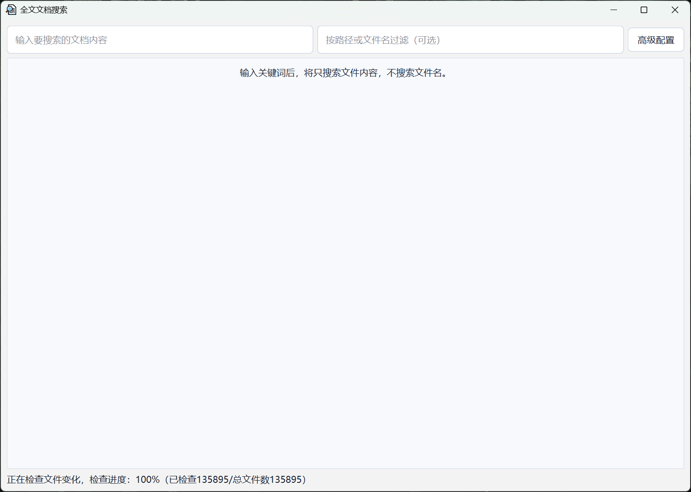
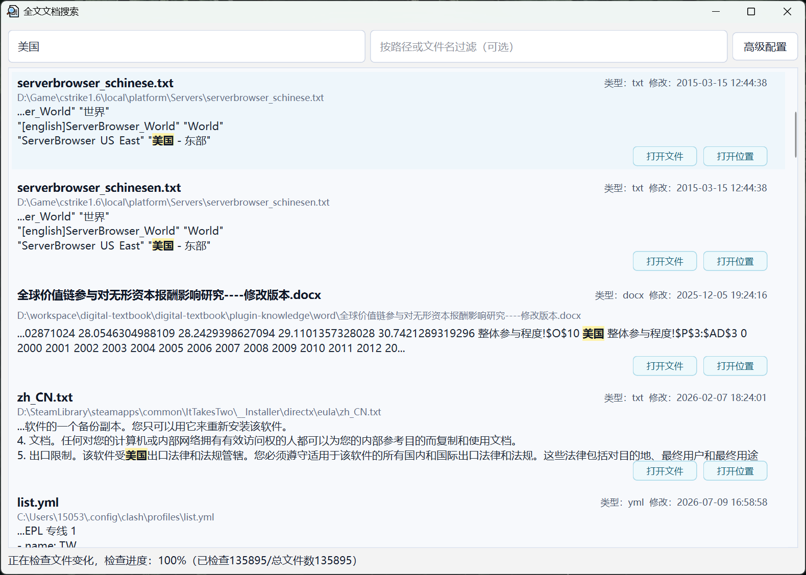
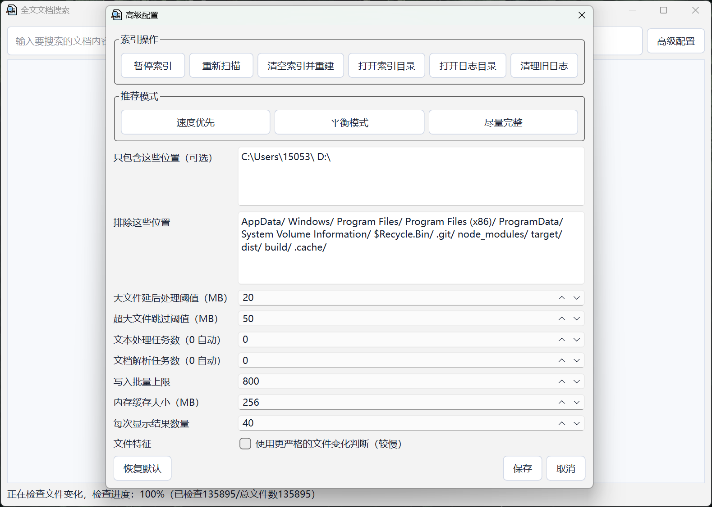

# 全文文档搜索

Windows 桌面全文搜索工具，支持纯文本文件和 PDF/Office 文档内容搜索。

## 软件截图







## 开发运行

```powershell
.\.venv\Scripts\python.exe -m app.main
```

## 打包

```powershell
.\build.ps1
```

打包完成后，双击：

```text
dist\DocContentSearch\DocContentSearch.exe
```
